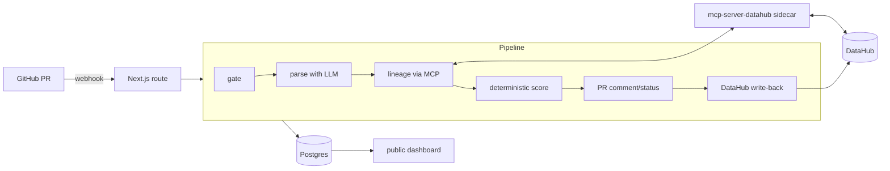

# Threxa

**The blast-radius agent for data model PRs.**

Threxa reviews SQL and dbt pull requests before they merge. It uses the official DataHub MCP server to trace downstream lineage, identifies affected tables and dashboards, posts a deterministic SAFE / RISKY / BREAKING verdict on the PR, and writes the change back into the catalog.

[Live Dashboard](https://web-production-81ecf4.up.railway.app/dashboard) · [Product Site](https://web-production-81ecf4.up.railway.app) · [Docs](https://web-production-81ecf4.up.railway.app/docs) · [Get Started](https://web-production-81ecf4.up.railway.app/get-started) · [Repository](https://github.com/mystiquemide/threxa)

[](https://github.com/mystiquemide/threxa/actions/workflows/ci.yml)
[](https://github.com/mystiquemide/threxa/actions/workflows/codeql.yml)
[](LICENSE)

## Problem

Data teams often discover breaking model changes after the merge. A PR drops or renames a column, but the real damage sits downstream: dashboards, models, owners, incidents, and customer-facing reports that depend on that field.

Generic code review cannot answer the key question: what is the blast radius in the catalog? Without lineage-aware review, teams either merge risky changes blindly or slow every PR with manual investigation.

## Solution

Threxa turns a data-model PR into a catalog-aware verdict.

A PR drops a column. Threxa walks DataHub lineage, finds downstream assets that consume it, names owners, posts BREAKING with a migration path, and records the change back in DataHub. Before the merge, not three days later.

The LLM parses and explains. Deterministic code decides severity. Missing lineage never returns SAFE.

## Product screenshots or demo

| Blast radius detail | Run history |
|---|---|
|  |  |

| Product site |
|---|
|  |

Live judge path:

1. Open the [product site](https://web-production-81ecf4.up.railway.app).
2. Open the [dashboard](https://web-production-81ecf4.up.railway.app/dashboard).
3. Review a sample run and its impacted downstream assets.
4. Read the [docs route](https://web-production-81ecf4.up.railway.app/docs) for setup and trust boundaries.

## How it works

1. A GitHub webhook fires when a PR touches SQL or dbt model files.
2. The webhook route verifies the HMAC signature and acknowledges quickly.
3. An LLM parses the diff into structured change intents such as dropped, renamed, retyped, or logic-changed columns.
4. Threxa queries DataHub through the official `mcp-server-datahub` sidecar for downstream lineage, owners, and schemas.
5. A deterministic scorer assigns SAFE, RISKY, or BREAKING.
6. Threxa posts or updates one PR comment with severity, impacted assets, owners, and migration guidance.
7. BREAKING also sets a failing commit status.
8. The analysis is persisted in Postgres and shown on the public dashboard.
9. Every run writes a change record back to DataHub; merged BREAKING PRs raise incidents on affected downstream assets.

## Key features

- **Lineage-aware PR review** - reviews data changes against DataHub lineage, not just the diff text.
- **Deterministic severity** - the LLM never decides SAFE, RISKY, or BREAKING.
- **Zero false SAFE bias** - missing lineage or unresolved entities cannot produce SAFE.
- **GitHub verdict comments** - one upserted PR comment carries severity, impact table, explanation, and migration path.
- **Catalog write-back** - DataHub remembers the reviewed change and can receive incidents for merged breaking changes.
- **Public run dashboard** - judges and platform leads can inspect run history and blast radius details.
- **Railway sidecar architecture** - web app, DataHub MCP server, and Postgres deploy as separate services.

## Why it is different

| Alternative | What it does | Threxa difference |
|---|---|---|
| Generic AI code review | Summarizes a diff | Threxa asks DataHub what the diff breaks downstream. |
| dbt tests | Catch expected model failures | Threxa maps impact before merge and names owners/assets. |
| Manual lineage checking | Human opens catalog and traces dependencies | Threxa automates the trace and posts a PR verdict. |
| LLM-only reviewer | Can hallucinate severity | Threxa uses LLMs for parsing/prose and deterministic code for severity. |

## Architecture



Components:

- **Frontend and API:** Next.js 16 App Router on Railway.
- **Pipeline:** `src/lib/pipeline/` with gate, parse, lineage, score, comment, writeback, and persist stages.
- **Catalog:** DataHub GMS plus official MCP server.
- **Database:** Railway Postgres through Prisma 7.
- **LLM:** configured through `src/lib/ai.ts` for structured parsing and verdict prose.
- **GitHub integration:** webhook verification, PR comments, and commit statuses.

## Sponsor integrations

### DataHub

- Uses the official `mcp-server-datahub` component as a sidecar service.
- Queries downstream lineage, owners, schemas, and column-level usage.
- Writes change records back into DataHub entities.
- Raises incidents for merged BREAKING changes.

### Devpost challenge fit

Built for **Build with DataHub: The Agent Hackathon**. The DataHub integration is not decorative: without DataHub lineage and the MCP server, Threxa cannot compute its blast radius verdict.

## Live deployment and proof

| Proof item | Value |
|---|---|
| Live product | https://web-production-81ecf4.up.railway.app |
| Dashboard | https://web-production-81ecf4.up.railway.app/dashboard |
| Docs route | https://web-production-81ecf4.up.railway.app/docs |
| Repository | https://github.com/mystiquemide/threxa |
| CI | https://github.com/mystiquemide/threxa/actions/workflows/ci.yml |
| CodeQL | https://github.com/mystiquemide/threxa/actions/workflows/codeql.yml |
| Submission status | Awaiting submission - demo video pending |

## Tech stack

- **Frontend/API:** Next.js 16 App Router, React 19, TypeScript, Tailwind CSS 4
- **Data:** Prisma 7, Railway Postgres
- **Catalog:** DataHub GMS, official `mcp-server-datahub`
- **AI:** LLM structured parsing and explanation through `src/lib/ai.ts`
- **Integrations:** GitHub webhooks, GitHub REST comments/statuses, DataHub GraphQL write-back
- **Deployment:** Railway web service, Railway sidecar, Railway Postgres
- **Quality:** Vitest, ESLint, CodeQL, GitHub Actions

## Installation instructions

Prerequisites:

- Node.js 22+
- Python 3.10+
- Docker
- A GitHub repository where you can create webhooks
- A DataHub instance or local quickstart
- LLM API key matching your `.env` configuration

```bash
git clone https://github.com/mystiquemide/threxa.git
cd threxa
npm install
cp .env.example .env
```

Start DataHub with sample lineage:

```bash
pip install acryl-datahub
datahub docker quickstart
datahub datapack load showcase-ecommerce
```

Start the official DataHub MCP server:

```bash
pip install mcp-server-datahub
DATAHUB_GMS_URL=http://localhost:8080 mcp-server-datahub --transport http
```

Run Threxa:

```bash
npx prisma migrate dev
npm run dev
```

Point a GitHub webhook for `pull_request` events at:

```text
<your-host>/api/webhooks/github
```

No DataHub handy? Set `NEXT_PUBLIC_DEMO_MODE=true` and open `/dashboard` for clearly labelled sample data.

## Environment variables

| Variable | Purpose |
|---|---|
| `GROQ_API_KEY` | Diff parsing and verdict prose |
| `GROQ_MODEL` | Optional model override |
| `DATABASE_URL` | Postgres connection string |
| `DATAHUB_GMS_URL` | DataHub GMS endpoint |
| `DATAHUB_TOKEN` | Catalog access token, if auth is enabled |
| `MCP_SERVER_URL` | `mcp-server-datahub` endpoint |
| `GITHUB_WEBHOOK_SECRET` | GitHub webhook signature secret |
| `GITHUB_TOKEN` | PR comments and commit statuses |
| `NEXT_PUBLIC_DEMO_MODE` | Labelled sample dashboard data |
| `NEXT_PUBLIC_DATAHUB_UI_URL` | Catalog links in the dashboard |

## Testing

```bash
npm run lint
npm test
npm run build
```

The test suite covers the PR gate, deterministic scorer, and the zero-false-SAFE invariant. CI runs lint, tests, build, and CodeQL on GitHub.

## Challenges and lessons

- The product needed a strict boundary: LLMs can parse and write explanations, but cannot decide severity.
- Missing lineage is a safety condition, not a reason to mark a PR safe.
- GitHub webhooks must acknowledge quickly, so the heavy analysis runs after the response.
- The official DataHub MCP server is best treated as a sidecar, keeping Python catalog tooling separate from the Next.js app.
- Public dashboards are useful for judges, but webhook writes still need HMAC verification.

## Roadmap

### Before submission

- Record the demo video.
- Add the final Devpost submission link when available.
- Keep Railway services and sample dashboard stable for judging.

### Post-hackathon V1

- Add richer multi-hop lineage visualizations.
- Add repository-level policy configuration.
- Add Slack or Linear notifications for BREAKING verdicts.

### Longer term

- Support more catalogs through the same pipeline contract.
- Add hosted onboarding for teams without a local DataHub setup.
- Track recurring risky owners, models, and schema-change patterns.

## Scope and safety

Threxa is hackathon software. It reviews PRs, comments on GitHub, updates catalog metadata, and records run data. It does not merge pull requests or apply schema changes by itself.

## Contributing and security

See [CONTRIBUTING.md](CONTRIBUTING.md) and [SECURITY.md](SECURITY.md).

## License

Apache 2.0. See [LICENSE](LICENSE).
