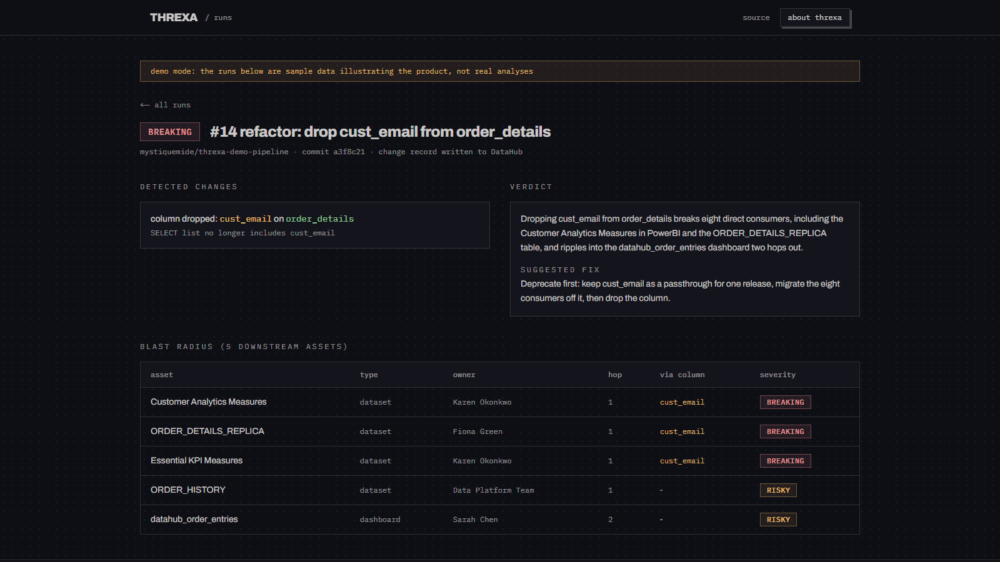
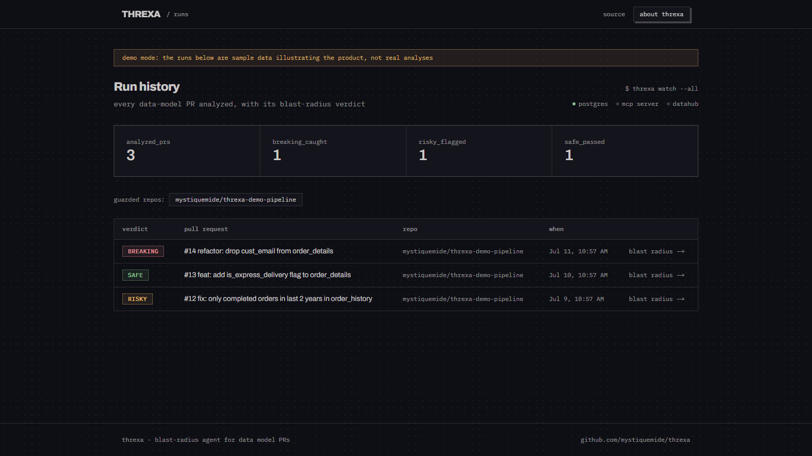
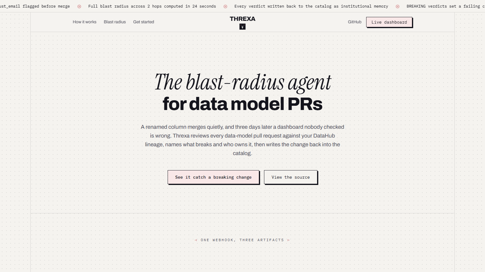
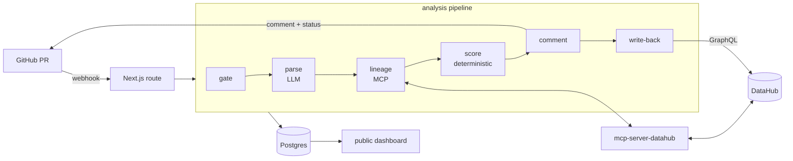

# Threxa

The agent that stops data breaking changes before they merge.

[](https://github.com/mystiquemide/threxa/actions/workflows/ci.yml)
[](https://github.com/mystiquemide/threxa/actions/workflows/codeql.yml)
[](LICENSE)

A PR drops a column. Threxa walks your DataHub lineage, finds the 8 dashboards and tables that consume it, names their owners, posts BREAKING on the PR with a migration path, and writes the change into the catalog. Before the merge, not three days after.



**Live:** [dashboard](https://web-production-81ecf4.up.railway.app/dashboard) &middot; [product site](https://web-production-81ecf4.up.railway.app) &middot; [docs](https://web-production-81ecf4.up.railway.app/docs) &middot; [get started](https://web-production-81ecf4.up.railway.app/get-started)

## How a verdict happens

1. A GitHub webhook fires when a PR touches SQL or dbt model files.
2. An LLM parses the diff into structured change intents (columns dropped, renamed, retyped, logic changed).
3. Threxa queries DataHub through the official [MCP server](https://github.com/acryldata/mcp-server-datahub) for downstream lineage, owners, and schemas, including column-level lineage to check whether affected columns are actually consumed.
4. A deterministic scorer assigns SAFE, RISKY, or BREAKING. The LLM never decides severity, and missing lineage never yields SAFE.
5. One PR comment carries the verdict: severity, impact table (asset, type, owner, hop, via-column), a plain-language explanation, and a migration path referencing real column names. BREAKING also sets a failing commit status.
6. Every analysis writes a change record back to the touched DataHub entities. Merging a BREAKING PR raises incidents on the affected downstream assets. The catalog remembers.

## Product

| Run history | Product site |
|---|---|
|  |  |

## Architecture



Full design, data model, failure paths, and decision records: [docs/ARCHITECTURE.md](docs/ARCHITECTURE.md).

## Quickstart (~10 minutes)

Prereqs: Docker, Python 3.10+, Node 22+, a Groq API key, a GitHub repo you can webhook.

```bash
# 1. DataHub with sample lineage
pip install acryl-datahub
datahub docker quickstart
datahub datapack load showcase-ecommerce
# UI: http://localhost:9002 — create an access token under Settings if auth is enabled

# 2. The official DataHub MCP server
pip install mcp-server-datahub
DATAHUB_GMS_URL=http://localhost:8080 mcp-server-datahub --transport http
# serves http://localhost:8000/mcp; add DATAHUB_GMS_TOKEN if your instance has auth

# 3. Threxa
git clone https://github.com/mystiquemide/threxa && cd threxa
npm install
cp .env.example .env   # fill in the values from steps 1-2
npx prisma migrate dev
npm run dev

# 4. Point a GitHub webhook (pull_request events, your GITHUB_WEBHOOK_SECRET)
#    at <your tunnel>/api/webhooks/github, then open a PR that drops a column
#    from a model matching a showcase-ecommerce entity. The verdict comment
#    lands on the PR and the run appears at /dashboard.
```

No DataHub handy? Set `NEXT_PUBLIC_DEMO_MODE=true` and open `/dashboard` to click through sample verdicts (clearly labeled as sample data).

## Environment

| Variable | Purpose |
|---|---|
| `GROQ_API_KEY` | diff parsing and verdict prose |
| `GROQ_MODEL` | optional model override |
| `DATABASE_URL` | Postgres connection string |
| `DATAHUB_GMS_URL` | DataHub GMS endpoint |
| `DATAHUB_TOKEN` | catalog access token, if auth is enabled |
| `MCP_SERVER_URL` | mcp-server-datahub endpoint |
| `GITHUB_WEBHOOK_SECRET` | webhook signature secret |
| `GITHUB_TOKEN` | posts comments and statuses |
| `NEXT_PUBLIC_DEMO_MODE` | labeled sample data, no backend needed |
| `NEXT_PUBLIC_DATAHUB_UI_URL` | enables catalog links in the dashboard |

## Development

```bash
npm run lint    # eslint
npm test        # scorer + gate unit tests (the zero-false-SAFE invariant lives here)
npm run build   # typecheck + production build
```

CI runs all three on every push and pull request, plus CodeQL analysis.

## Repository layout

```
src/lib/pipeline/   gate, parse, lineage, score, comment, writeback, persist
src/lib/            github, datahub, ai clients; types contract
src/app/api/        webhook receiver, run reads, health
src/app/            marketing site and dashboard
prisma/             schema and migrations
scripts/            live verification probes against DataHub + MCP
docs/               architecture and decision records
```

## Contributing and security

See [CONTRIBUTING.md](CONTRIBUTING.md) to get involved and [SECURITY.md](SECURITY.md) for reporting vulnerabilities.

## License

Apache 2.0
